# Implementasi Arsitektur YOLOv8-Pose Untuk Analitik Longitudinal Degradasi Postur Duduk Sebagai Indikator Kelelahan
## AI-Based Longitudinal Posture Analytics using YOLOv8-Pose

[](https://www.python.org/)
[](https://github.com/ultralytics/ultralytics)
[]()
[]()
[]()

*Implementation of a computer vision system for analyzing sitting posture degradation trends as an ergonomic fatigue indicator.*

An AI-based posture analytics system that utilizes YOLOv8-Pose for extracting human pose keypoints and analyzing longitudinal changes in sitting posture quality. Developed by **Kelompok 4 Kelas PSIK 23 A**.

---

## 1. Project Overview & Latar Belakang

Aktivitas sedentary (duduk statis berdurasi lama di depan komputer) dapat memicu penurunan kualitas postur duduk pengguna secara bertahap akibat kelelahan otot inti. Penurunan postur yang terus dibiarkan berisiko memicu keluhan muskuloskeletal (*Musculoskeletal Disorders* / MSDs) seperti nyeri punggung bawah, *forward head posture*, ketegangan leher, dan kifosis.

Sistem pemantauan postur konvensional umumnya menggunakan notifikasi atau alarm instan (*real-time alerts*) yang memutus fokus kerja pengguna. Proyek ini mengusulkan paradigma **Silent Longitudinal Posture Analytics** untuk menganalisis tren degradasi kualitas duduk sebagai indikator potensi kelelahan ergonomis menggunakan kamera web (*webcam*) standar tanpa interupsi alarm.

```
                  [ Aliran Video Kamera Web ]
                               ↓
                      [ Model YOLOv8-Pose ]
                               ↓
             [ Ekstraksi Koordinat 4 Keypoint Kustom ]
                 (Hip, Spine, Shoulder, Head)
                               ↓
              [ Penyaringan Jitter 20-Frame Deque ]
                               ↓
             [ Kalkulasi Sudut Segmen Torso & Leher ]
                               ↓
               [ Continuous Scoring & Status Map ]
                               ↓
               [ Log Periodik 30 Detik ke Database ]
                               ↓
           [ Ekspor Akhir Sesi: CSV, PDF & Grafik Dual-Axis ]
                               ↓
            [ Sinkronisasi Otomatis ke Dasbor Presentasi ]
```

---

## 2. Realtime Monitoring vs Longitudinal Analytics

Sistem ini memisahkan pemrosesan kualitas postur menjadi dua lapisan terintegrasi:

### Realtime Pose Monitoring
* **Alur Pemrosesan (Pipeline)**:
  `Webcam Frame` ➔ `Inference YOLOv8-Pose` ➔ `Ekstraksi 4 Keypoint` ➔ `Kalkulasi Sudut Sendi` ➔ `Pembaruan Skor Postur Realtime`.
* **Karakteristik**: Inferensi dijalankan secara kontinu (per frame) dan informasi postur pada visualisasi layar diperbarui secara instan. Digunakan untuk pemantauan langsung di tempat.

### Longitudinal Analytics
* **Alur Pemrosesan (Pipeline)**:
  `Realtime Posture Data` ➔ `Temporal Aggregation (Smoothing)` ➔ `Periodic Sampling (Setiap 30 Detik)` ➔ `Pencatatan CSV Log` ➔ `Analisis Tren Degradasi` ➔ `Laporan PDF Sesi`.
* **Karakteristik**: Tidak setiap frame inferensi disimpan ke database untuk mencegah overload penyimpanan. Data disampel secara periodik untuk meredam noise akibat pergerakan dinamis sementara, serta digunakan untuk memetakan pola degradasi postur sebagai indikator potensi kelelahan ergonomis.

*Sistem tetap dikategorikan berjalan secara realtime karena inferensi pose dan evaluasi sudut dilakukan terus-menerus pada frame video aktif; sampling periodik hanya diterapkan untuk penyimpanan data analitik longitudinal.*

---

## 3. Fitur Utama Sistem

* **Real-Time Pose Estimation**: Mendeteksi letak anatomi sendi tubuh dengan model ringan YOLOv8n-pose.
* **4-Keypoint Custom Tracking**: Melacak koordinat utama duduk: *Hip* (pinggul), *Spine* (punggung tengah), *Shoulder* (bahu), dan *Head* (kepala).
* **Torso & Neck Angle Analysis**: Menggabungkan inklinasi punggung bawah ($30\%$) dan punggung atas ($70\%$) agar sensitif mendeteksi bungkukan (*slouching*).
* **Temporal Smoothing**: Menyaring *frame-to-frame sensor jitter* menggunakan filter *moving average* temporal 20 frame.
* **Continuous Posture Scoring**: Skala penilaian kontinu linear ($0-100$) berdasarkan koefisien penalty untuk mencegah lompatan data tidak realistis pada visualisasi longitudinal.
* **Automated Sync Layer**: Pipa penyelarasan otomatis ([docs_sync.py](file:///d:/cv-posture/app/docs_sync.py)) yang memindahkan berkas hasil sesi (CSV, PDF, Grafik) ke dasbor web di akhir pemantauan.
* **Responsive Presentation Dashboard**: Dasbor statis Vanilla JS satu halaman viewport-safe (tanpa scrollbar luar) dilengkapi progress bar interaktif untuk keperluan demonstrasi sidang.

---

## 4. Kontribusi Utama Proyek

1. **Implementasi YOLOv8-Pose** untuk ekstraksi keypoint tubuh dalam posisi duduk secara akurat.
2. **Kalkulasi Analitik Postur Kustom** menggunakan estimasi sudut torso bawah/atas tertimbang dan sudut leher.
3. **Analisis Longitudinal Degradasi Postur Duduk** sebagai indikator potensi kelelahan sepanjang sesi.
4. **Otomatisasi Pelaporan Postur** terintegrasi dalam format CSV, visualisasi grafik, dan laporan PDF terstruktur.

---

## 5. Metode & Spesifikasi Sistem

### Spesifikasi Alur Kerja
* **Input**: Frame kamera web (*webcam frame*).
* **Pemrosesan (Processing)**: Model YOLOv8-Pose mendeteksi koordinat letak keypoint tubuh duduk.
* **Ekstraksi Fitur (Feature Extraction)**: Menghitung sudut torso ($\theta_{torso}$) dan sudut leher ($\theta_{neck}$).
* **Analitik (Analytics)**: Rata-rata berjalan temporal, kalkulasi skor kontinu linier, penentuan status ergonomi (Excellent, Moderate, Poor), dan pemetaan tren degradasi postur duduk.
* **Output**: Arsip CSV log, grafik longitudinal sumbu ganda (`posture_graph.png`), dan dokumen laporan PDF.

---

## 6. Dataset & Image Preprocessing

Model dilatih menggunakan dataset primer berupa variasi citra posisi duduk tegak (*excellent*), membungkuk sedang (*moderate*), dan membungkuk parah (*poor*) dari sudut samping (*lateral view*).

### Skema Koordinat 4 Keypoint Tubuh
Anotasi diletakkan secara presisi pada 4 titik anatomi:
1. `KP0` (Hip): Jangkar posisi duduk.
2. `KP3` (Spine): Indikator kelenturan tulang belakang.
3. `KP1` (Shoulder): Batas atas torso.
4. `KP2` (Head): Penentu inklinasi leher.

| Skeleton Annotation Sample | Keypoint Heatmap Distribution |
| :---: | :---: |
| 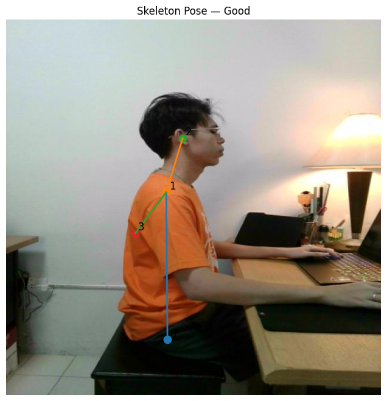 | 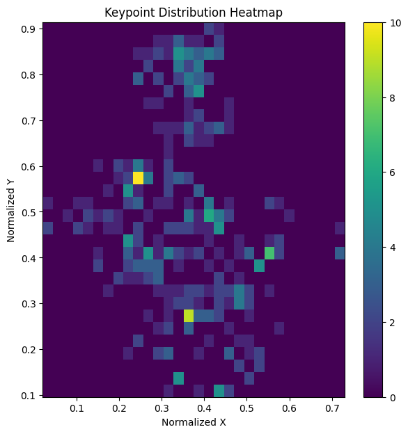 |

### Preprocessing & Data Augmentation
Untuk meningkatkan ketangguhan model terhadap variasi cahaya kamar dan latar belakang, dataset mentah diperbanyak melalui augmentasi:
* Penyesuaian Kecerahan (*brightness modification*).
* Peningkatan Kontras (*contrast enhancement*).
* Rotasi Kecil ($\pm 5^\circ$) dan Filter Gaussian Noise/Blur.

| Original | Normalization | Brightness | Gaussian | Rotate & Flip |
| :---: | :---: | :---: | :---: | :---: |
| 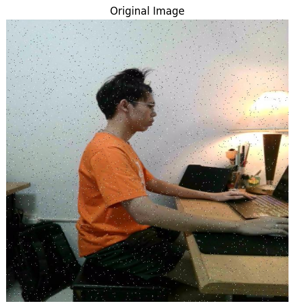 | 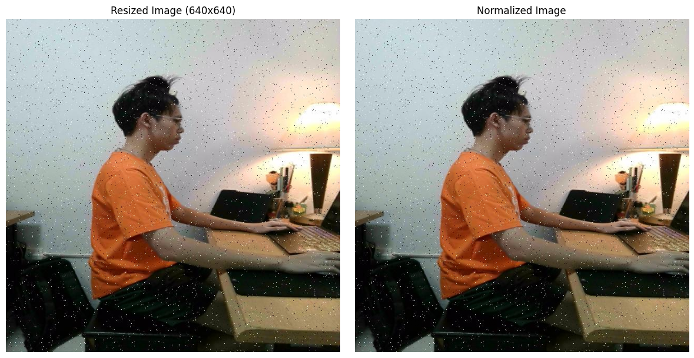 | 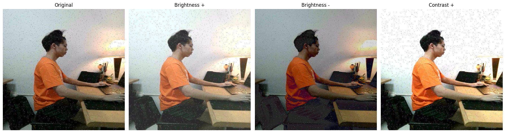 | 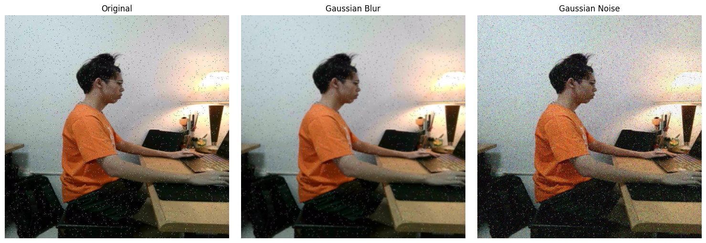 | 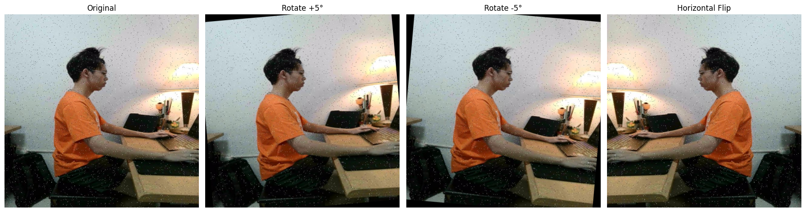 |

---

## 7. Hasil Pelatihan Model YOLOv8-Pose

Model YOLOv8n-pose dilatih selama 150 epoch menggunakan komputasi GPU NVIDIA RTX 3050. Evaluasi menunjukkan tingkat keakuratan spasial keypoint yang sangat tinggi:

| Evaluasi Metrik | Hasil Pelatihan | Deskripsi Performa |
| :--- | :--- | :--- |
| **Pose mAP50** | **97.8%** | Akurasi lokalisasi letak keypoint tubuh sangat optimal. |
| **Precision** | **98.0%** | Tingkat ketepatan deteksi titik koordinat. |
| **Recall** | **86.0%** | Tingkat keberhasilan menemukan seluruh keypoint target. |
| **Validation Loss Gap** | **0.023** | Selisih loss latih/validasi sangat rendah (bebas overfitting). |

| Kurva Loss Latih vs Validasi | Evaluasi Epoch | Deteksi Batch Prediksi |
| :---: | :---: | :---: |
| 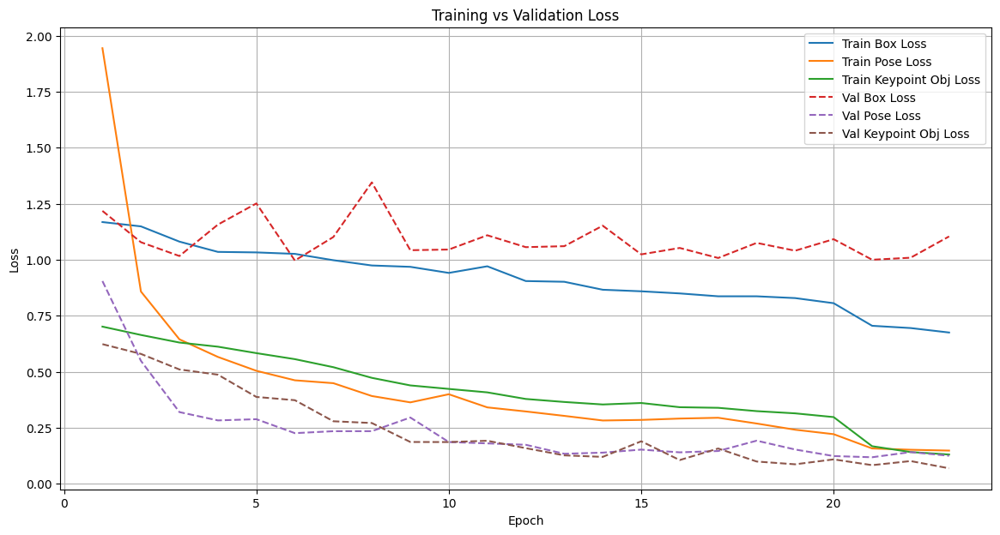 | 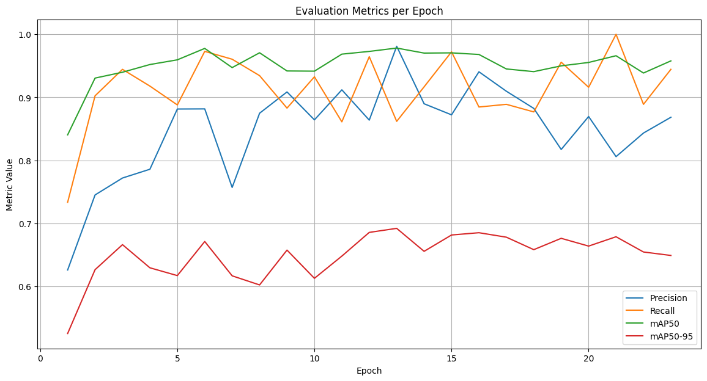 | 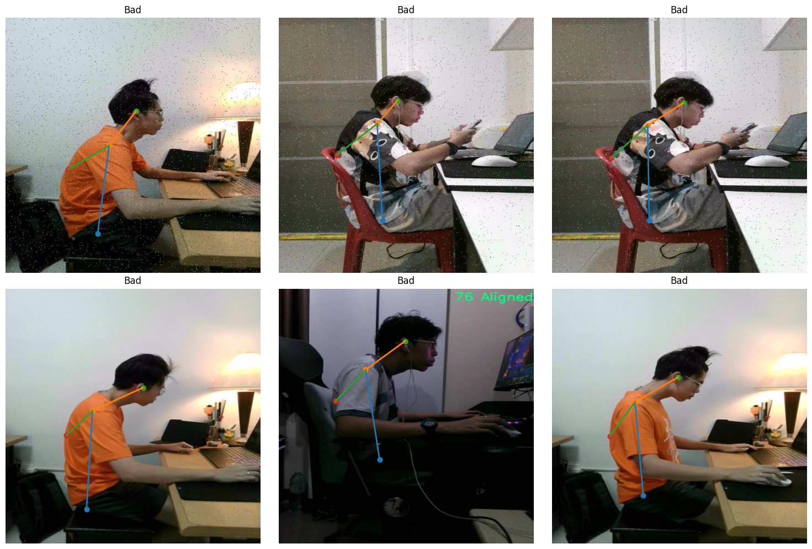 |

---

## 8. Demonstrasi Realtime & Analitik Longitudinal

### Realtime Inference
Saat aplikasi dijalankan, jendela OpenCV menyajikan visual aliran tangkap webcam dengan overlay metrik sudut derajat torso, sudut leher, skor kumulatif, dan status ergonomi saat ini. 

*Menekan hotkey `S` / `s` secara otomatis menyimpan tangkapan layar ini langsung ke repositori dasbor.*

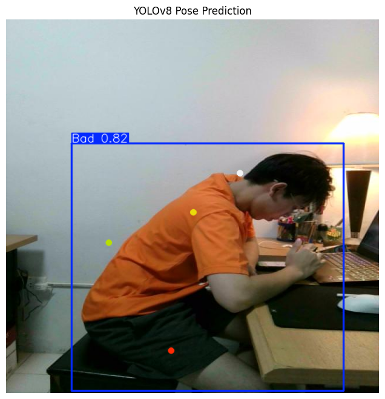

### Longitudinal Analytics
Di akhir sesi pemantauan, grafik longitudinal dihasilkan bersumbu ganda (**Double Y-Axis**) untuk memisahkan sumbu skor ergonomis (0-100, kiri) dari derajat sudut fisik tubuh (kanan), dipetakan berdasarkan tren waktu (timestamp) sesi.

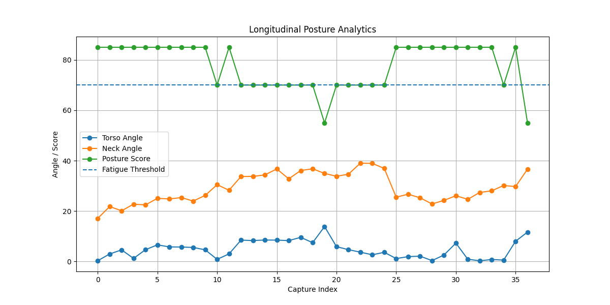

---

## 9. Struktur Direktori Proyek

```text
cv-posture/
├── app/                        # Modul Pemrosesan Utama Proyek
│   ├── analytics.py            # Kalkulasi grafik dual-axis & statistik fatigue
│   ├── docs_sync.py            # Otomatisasi transfer data ke dasbor web
│   ├── main.py                 # Loop utama penangkap kamera & logging
│   ├── posture_engine.py       # Inferensi YOLOv8-Pose, filter dekes, & kontinu scoring
│   └── report.py               # Penyusun dokumen PDF Reportlab
├── demo/
│   └── realtime_posture.py     # Script demonstrasi interaktif mandiri
├── docs/                       # Situs Web Dasbor Riset Satu Halaman (Showcase)
│   ├── assets/                 # Aset citra latih, preprocessing, & visual analitik
│   │   └── latest/             # Destinasi salinan otomatis berkas sesi terbaru
│   ├── index.html              # Struktur dasbor viewport-safe dark-theme
│   ├── style.css               # Desain glassmorphism & kolom scroll mandiri
│   └── script.js               # Handler navigasi, tab switch, & loader JSON
├── records/                    # Direktori penyimpanan log CSV periodik lokal
├── reports/                    # Direktori penyimpanan grafik PNG & PDF lokal
├── test/
│   └── 01_preprocessing_demo.ipynb
├── requirements.txt            # Dependensi pustaka proyek
└── DOCUMENTATION.md            # Naskah draf makalah, slide sidang, oral script, & Q&A
```

---

## 10. Instalasi & Setup Lingkungan

1. **Klon Repositori**:
   ```bash
   git clone https://github.com/rizkywahyudiii/postur-yolov8.git
   cd postur-yolov8
   ```

2. **Buat & Aktivasi Virtual Environment**:
   ```powershell
   # Windows
   python -m venv venv
   .\venv\Scripts\activate
   ```

3. **Instalasi PyTorch dengan Dukungan Akselerasi CUDA GPU**:
   ```bash
   pip install torch torchvision torchaudio --index-url https://download.pytorch.org/whl/cu118
   ```

4. **Instalasi Pustaka Dependensi Proyek**:
   ```bash
   pip install -r requirements.txt
   ```

---

## 11. Panduan Penggunaan Sistem

### Menjalankan Pemantauan Postur (Aplikasi Utama)
Jalankan berkas utama [main.py](file:///d:/cv-posture/app/main.py):
```bash
cd app
python main.py
```
* **Realtime Inference**: Jendela kamera akan langsung mendeteksi postur duduk Anda.
* **Tangkapan Layar Hotkey**: Tekan tombol `S` pada keyboard saat jendela kamera aktif untuk menyimpan tangkapan layar frame terbaru ke situs web dasbor.
* **Mengakhiri Sesi**: Tekan tombol `Q` pada keyboard untuk menghentikan pemantauan. Sistem akan otomatis mengekspor berkas log CSV, grafik evaluasi dual-axis, PDF report, serta memperbarui berkas ringkasan `session_summary.json` di dalam dasbor.

### Menjalankan Demonstrasi Interaktif Mandiri
Untuk menjalankan visualisasi demo cepat tanpa pelaporan ekspor:
```bash
cd demo
python realtime_posture.py
```

### Membuka Dasbor Dokumentasi
Cukup buka berkas [index.html](file:///d:/cv-posture/docs/index.html) menggunakan peramban web (*web browser*) di komputer Anda untuk melihat presentasi riset interaktif secara offline maupun online.

---

## 12. Batasan & Rencana Masa Depan

### Batasan Sistem
1. **Dimensi Perspektif Kamera 2D**: Pengukuran sudut geometri 2D rentan terhadap distorsi perspektif jika kamera bergeser secara frontal.
2. **Ketergantungan Sudut Kamera**: Akurasi analitik postur sangat bergantung pada penempatan posisi kamera web samping (*lateral view*).
3. **Bukan Rekomendasi Klinis**: Skor postur merepresentasikan estimasi ergonomis dan **bukan** merupakan asesmen medis klinis terverifikasi.
4. **Interpretasi Potensi Kelelahan**: Penilaian kelelahan (*fatigue*) didasarkan murni pada analisis kecenderungan degradasi postur, bukan berdasarkan pengukuran fisiologis langsung pada tubuh.

### Rencana Pengembangan
* **Personalized Baseline**: Menerapkan kalibrasi postur awal yang disesuaikan dengan postur unik tiap individu sebelum pemantauan dimulai.
* **Time-Series Forecasting**: Memprediksi degradasi tren penurunan kualitas postur duduk jangka panjang menggunakan model peramalan deret waktu.
* **Mobile & Edge Deployment**: Mengompilasi arsitektur model menjadi format TensorRT atau ONNX agar dapat berjalan stabil pada perangkat komputasi modular.

---

## Author & Kontributor
**Kelompok 4 • Kelas PSIK 23 A**
Proyek ini dikembangkan sebagai bagian dari tugas portofolio penelitian dan showcase demonstrasi sidang bidang sistem cerdas dan computer vision.